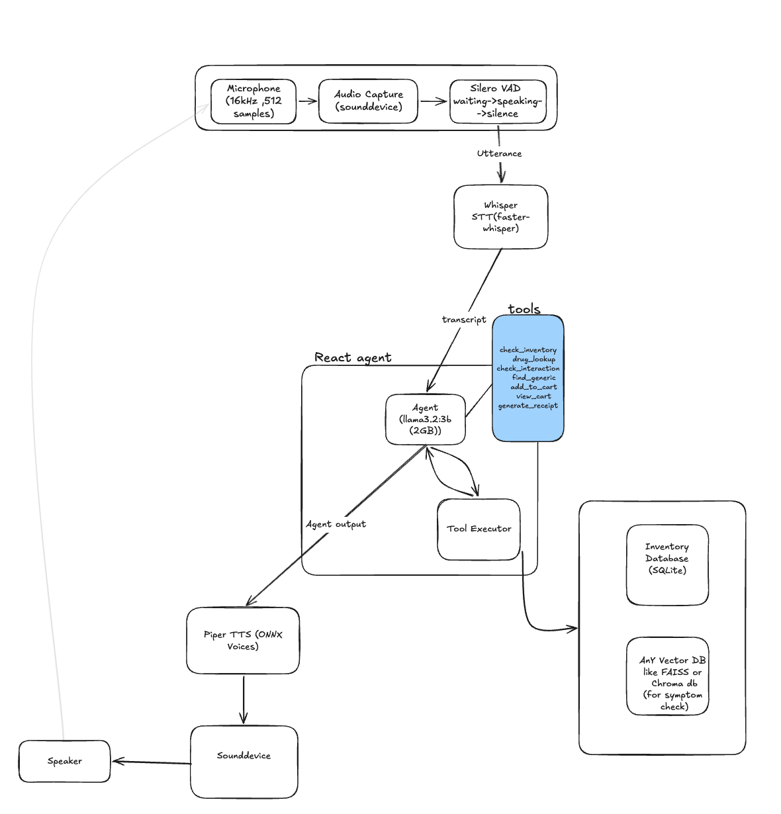

# Medicine Assistant

An **offline, voice-based pharmacy assistant** designed to run on an **edge device**.

It listens to a customer, understands the request, checks medicine availability or related information, and responds back using speech — all with a mostly local pipeline.

This project explores how to build a **real-world AI assistant for medicine retail / pharmacy workflows**, where low latency, offline capability, and simple interaction matter more than a flashy chatbot.

---
Demo Video : [Click here to see the magic :) ](https://drive.google.com/file/d/1PAXeMonhghAq51vourQpkxmVPeuo4NJ5/view?usp=sharing)

Exploration and research Doc : [What did i learn?](https://docs.google.com/document/d/1AOXohLjAbpuB70OzNNrurEVoUDmyn94OWiMRkmhple8/edit?usp=sharing)

## What it does

The assistant can:

* take **voice input** from a user
* detect when the user has finished speaking
* convert speech to text
* understand the request using a **local LLM agent**
* call tools to:

  * check medicine inventory
  * find generic alternatives
  * check interactions
  * add medicines to cart
  * view cart
  * generate receipt
* speak the answer back to the user

---

## Why Edge Device / Offline First?

This system is designed with an **edge deployment mindset**.

In many practical environments like:

* small pharmacies
* clinics
* rural healthcare counters
* medicine retail kiosks

you often cannot assume:

* reliable internet
* high-end GPUs
* cloud access for every request
* low-latency API calls

That’s why this assistant is built to run as much as possible **locally on-device**.

### Why this matters

* **Lower latency** → faster voice interaction
* **Better privacy** → customer queries stay local
* **More reliable** → still usable during poor connectivity
* **Cheaper to run** → no per-query cloud dependency
* **More deployable** → suitable for low-cost systems

This makes it closer to a **deployable edge AI assistant** than a typical web demo.

---

## Architecture

### Flow

1. **Microphone** captures live audio
2. **Audio Capture (`sounddevice`)** streams chunks
3. **Silero VAD** detects speech / silence boundaries
4. **Whisper STT** converts speech into text
5. Text is sent to a **ReAct-style Agent**
6. Agent decides whether to call tools
7. Tools access:

   * **SQLite** → inventory / medicine data
   * **Vector DB (FAISS / Chroma)** → symptom / semantic retrieval
8. Final response is converted to speech using **Piper TTS**
9. Audio is played through the **speaker**

---

## Tech Stack

* **Python**
* **Faster-Whisper** — speech to text
* **Silero VAD** — speech boundary detection
* **Ollama + Llama 3.2 3B** — local LLM
* **ReAct Agent** — reasoning + tool use
* **SQLite** — inventory database
* **FAISS / ChromaDB** — retrieval for symptom-style queries
* **Piper TTS** — offline text to speech
* **sounddevice** — audio I/O

---

## Why this project is interesting

This is not just a voice bot.

It combines:

* **real-time audio handling**
* **speech AI**
* **LLM tool calling**
* **retrieval + structured database access**
* **edge-device deployment thinking**

The interesting part is not only “can an LLM answer questions?”
It’s:

> **Can a small local system reliably help a user complete a practical task using voice?**

That’s a much more useful engineering problem.

---

## Example Queries

* *“I have a headache, do you have anything?”*
* *“Add Dolo 650 to my cart”*
* *“Do you have something similar to Crocin?”*
* *“Can I take these medicines together?”*
* *“Show my cart”*
* *“Generate the bill”*

---

## Future Improvements

* multilingual support
* better medicine safety guardrails
* streaming responses
* prescription-aware workflows
* faster inference on lower-end hardware
* improved retrieval for symptom-based queries

---

## Disclaimer

This project is a **voice AI system design / engineering prototype**.
It is **not medical advice** and should not replace a pharmacist or doctor.
It is just a prototype

---
